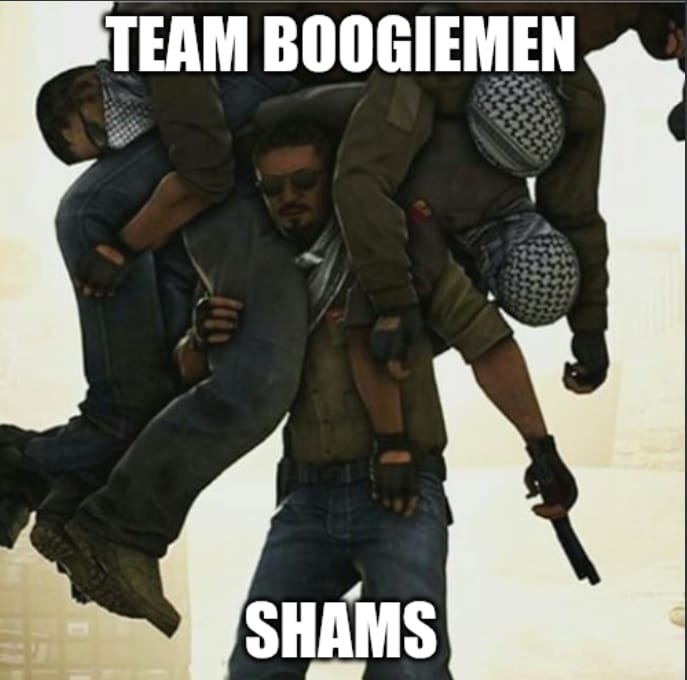

# 🎨 UI/UX Design Specifications: BarelyPassing 

Welcome to the Figma designs directory for the **Academic Progress & Outcome Tracking (BarelyPassing)** platform. This folder contains the complete visual architecture and user experience (UX) workflows for Evaluation 2.

### 🔗 Live Prototype
👉 **[Insert Link to your Figma File/Prototype Here]**

---

## 📐 Design Philosophy & System
The BarelyPaSSING platform is designed as a modern, enterprise-grade EdTech SaaS application. Our primary focus is on **data clarity, actionable insights, and responsive accessibility**.

* **Typography:** **Inter** (Industry standard for SaaS data-dense dashboards, optimizing number and chart readability).
* **Primary Brand Color:** `#4F46E5` (Indigo/Blue - conveys trust, focus, and academic professionalism).
* **Semantic Status Colors:** Strict adherence to color psychology for immediate user recognition:
    * 🟢 **Success/On-Track:** `#10B981` (Approved leaves, >75% attendance).
    * 🟡 **Warning/Pending:** `#F59E0B` (Approaching deadlines, pending requests).
    * 🔴 **Danger/At-Risk:** `#EF4444` (<75% attendance, fee defaulters).
* **Layout:** Grid-based, card-driven UI utilizing pure white (`#FFFFFF`) surface cards over an off-white (`#F9FAFB`) background to reduce eye strain.

---

## 🗺️ Screen Inventory (Mapped to Agile Epics)

The designs are categorized by Role-Based Access Control (RBAC) to ensure a tailored user experience for every actor in the system.

### 🔐 Epic 1: Core Infrastructure & Auth
* **Universal Login Hub:** Split-screen authentication interface featuring secure credential input and intuitive Role Selection (Student, Faculty, Academic Head).

### 👨‍🎓 Epic 2: The Student Experience
* **Student Dashboard:** High-level overview featuring a dynamic circular attendance gauge and upcoming task widgets.
* **Syllabus Completion Tracker:** Visual progress bars mapping completed topics against the total course modules.
* **Detailed Grade View:** Interactive outcome-based performance charts (CO/PO mapping) and question-wise marks analysis.
* **Leave Management Modal:** Split-layout interface for submitting date-bound leave requests alongside historical status tracking.
* **Honors/BTP Research Portal:** Vertical timeline tracking project milestones (Literature Review -> Final Submission) with upload drop-zones.

### 👩‍🏫 Epic 3: Faculty Operations
* **Faculty Dashboard (Analytics):** Visual early-intervention system highlighting "At-Risk" students and aggregate class performance.
* **Mobile-Optimized Attendance:** Responsive swipe/checkbox interface featuring a "Mark All Present" workflow to optimize classroom time.
* **Assessment Mapping:** Grid interface linking individual exam questions to specific Course Outcomes (CO) and Program Outcomes (PO).
* **Discussion Forum Moderation:** Contextual, thread-based peer discourse categorized by specific lecture topics.

### 🏛️ Epic 4: Admin & Compliance (Academic Head)
* **Executive Dashboard:** Macro-level comparative analytics across different university departments (Pass Rates vs. Average Scores).
* **Institutional Reports:** Generation hub for downloading comprehensive PDF reports on academic performance and resource allocation.
* **Master Event Scheduler:** Interactive calendar interface for managing institutional events and activities.
* **Resource Management:** Real-time facility overview tracking the capacity and occupancy status of labs, halls, and classrooms.

---

## 📱 Responsive Design Note
In accordance with modern web standards and our project requirements, key operational screens (such as **Faculty Attendance Marking**) have been optimized with responsive mobile frames. This ensures critical data entry can be performed seamlessly on handheld devices during active lectures.

---
*Designed for Evaluation 2 - Full Stack Web Development*

---

### 🤫 The "Design Master" Dedication Corner

*We would like to dedicate this final section to **Shams**, the primary architect of this entire design system. His relentless work ethic and "unconventional" design methods truly made this project possible.*

*Here is a rare, behind-the-scenes look at Shams developing our entire design system in record time:*

*Disclaimer: Friendly team banter. The use of a satirical mobile game advertisement is a lighthearted commentary on how Shams achieved consistent, professional Auto Layouts so quickly. (Good job, Shams!)*
